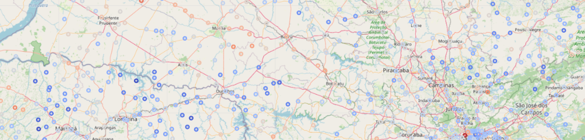

# bayes-at-scale
Cloud and GPU-accelerated probabilistic modeling for national- and global-level datasets. This repository shows how to conduct inference and prediction using large datasets and rich graphical models via GPU-backed Markov chain Monte Carlo in NumPyro.

# `brvehins` example
Notebooks `00` and `01` include code and logic for preprocessing data associated with the `brvehins` car insurance dataset of 2.6M records from Brazil in 2011 and building a spatial statistical model for that data. This dataset was reproduced from the `CASdatasets` package developed for R and hosted on GitHub at [this link](https://github.com/dutangc/CASdatasets). You can find more documentation on the origin of this data [here](https://www2.susep.gov.br/menuestatistica/Autoseg/principal.aspx). The file `data/brvehins/brvehins_raw.parquet` is a copy of the four RData files from the `brvehins2` dataset listed on the linked Git repository.